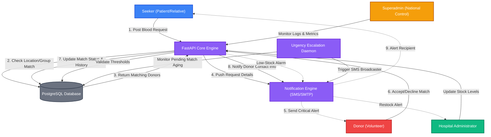

# 🩸 Software Requirements Specification (SRS) — Blood Reach BD

> **Version:** 1.1.0  
> **Status:** Approved / Week 1 Deliverable  
> **Target Region:** All 64 Districts & 7 Divisions of Bangladesh  
> *“Connecting donors, seekers, and hospitals — one drop at a time.”*

---

## 🗺️ 1. Introduction

### 1.1 Purpose
This document provides a comprehensive overview of the requirements, features, workflows, and system constraints for **Blood Reach BD**. It serves as the primary technical specification for developers, quality assurance engineers, and project supervisors during the 10-week development lifecycle.

### 1.2 Scope
Blood Reach BD is a full-stack, real-time blood matching and inventory platform. It bridges the critical communication gap between voluntary donors, seekers in high-pressure situations, and hospital blood banks. By incorporating location-based intelligence down to the district level and prioritizing urgent requests, the system guarantees direct connection paths when every second counts.

### 1.3 Intended Audience
- **Supervisors & Evaluators:** To verify alignment with Swe/DBMS academic guidelines.
- **Backend & Frontend Engineers:** For building schemas, APIs, and responsive views.
- **QA Engineers:** To design automated tests mapping to system requirements.

---

## 🔄 2. System Workflow & Data Flow Diagram

The diagram below details the real-time core workflow of Blood Reach BD, illustrating the life-cycle of a blood request, the matching process, notifications, and hospital inventory tracking:

---

## ⚡ 3. Functional Requirements

> The following 10 modules are derived directly from the official project roadmap (v1.0). Each module is tagged with its implementation **Phase** (P1–P4) matching the 10-week delivery schedule.

---

### Module 1 — User Management `[P1 → P2]`
*Registration, login, and profile management for all four user roles.*

- **Registration:** New users supply full name, email, password, and role during sign-up. Passwords are hashed before storage.
- **Login / Logout:** Email + password authentication issues a short-lived JWT (15 min) and a cookie-stored refresh token.
- **Profile CRUD:** Any authenticated user can read and update their own profile fields (name, contact number, address, avatar).
- **Role Assignment:** Role (`DONOR`, `SEEKER`, `HOSPITAL_ADMIN`, `SUPERADMIN`) is assigned at registration and enforced on every protected route.
- **Session Management:** Refresh token rotation invalidates old tokens on every renewal; logout revokes the active refresh token server-side.

---

### Module 2 — Donor Management `[P2]`
*Availability toggling, donation history tracking, and blood group CRUD.*

- **Availability Toggle:** Donors switch between `AVAILABLE` and `UNAVAILABLE` to opt in/out of receiving match alerts — preventing notification fatigue.
- **Blood Group CRUD:** Donors maintain an up-to-date blood group record (A+, A–, B+, B–, O+, O–, AB+, AB–) and last-donation date.
- **Donation History:** Every accepted and fulfilled match auto-creates a `donations` record linked to the donor, enabling a chronological donation log viewable from the dashboard.
- **Location Profile:** District and division stored per donor profile, used as the primary geo-filter input for the matching engine.

---

### Module 3 — Blood Request System `[P2]`
*Creation, status tracking, and lifecycle management of blood requests posted by seekers.*

- **Request Creation:** Seekers specify blood group, required units, patient name, target hospital, urgency level, and deadline when posting a request.
- **Status Lifecycle:** Every request moves through the states: `PENDING` → `MATCHING` → `FULFILLED` (or `EXPIRED` after the deadline passes without fulfillment).
- **Seeker Dashboard View:** Seekers can view all their active and past requests with current match counts and donor contact visibility once a match is accepted.
- **Request Cancellation:** Seekers may cancel unfulfilled requests, which triggers a status update and suppresses further notifications to matched donors.
- **Fulfillment Acknowledgement:** When a seeker marks a request as fulfilled, the system auto-creates a `donations` record and updates the donor's history.

---

### Module 4 — Location-Based Matching `[P2 → P3]`
*Geo-filtering donors by district/division with proximity ranking.*

- **Hierarchical Data Seed:** PostgreSQL database pre-seeded with all 64 districts nested under their 7 parent divisions, enabling fast relational geo-queries.
- **Primary Match Query:** On request creation, the system queries donors with:
  1. Matching blood group
  2. `AVAILABLE` status
  3. Same district as the request (highest priority)
- **Proximity Fallback:** If insufficient donors are found in the same district, the query expands to all other districts within the same division.
- **National Fallback:** A final pass queries all available matching donors nationally, flagged as `REMOTE` matches.
- **Ranking Score:** Matched donors are ranked by recency of last donation, distance tier (local / division / national), and past acceptance rate.

---

### Module 5 — Urgency Prioritisation `[P3]`
*Queuing requests by severity with automatic critical-flag escalation.*

- **Urgency Levels:** Requests carry one of four severity labels: `LOW`, `MEDIUM`, `HIGH`, `CRITICAL`.
- **Priority Queue:** The matching engine processes `CRITICAL` requests first, independent of creation time.
- **Escalation Daemon:** A background `APScheduler` cron job checks every 5 minutes for `CRITICAL` requests unmatched for more than 30 minutes. On detection, it:
  1. Broadcasts an escalation SMS to all available matching donors within the division.
  2. Logs the escalation event in `audit_logs`.
  3. Flags the request with `escalated = true` to prevent duplicate escalations.
- **Auto-Expiry:** `LOW` / `MEDIUM` requests with no accepted match after their deadline are transitioned to `EXPIRED` and removed from the active queue.

---

### Module 6 — Notification Engine `[P3]`
*Email and SMS alerts triggered on match, fulfillment, and low-stock events.*

- **Trigger Events:** Notifications are dispatched on:
  | Event | Channel | Recipients |
  |---|---|---|
  | Match found | Email + SMS | Donor |
  | Donor accepted match | Email | Seeker |
  | Request fulfilled | Email | Donor + Seeker |
  | Critical escalation | SMS | All district donors |
  | Hospital low-stock | Email | Hospital Admin |
  | New user registration | Email | Registrant |
- **Delivery Backend:** Primary email via `smtplib` / Mailgun API; SMS via bKash API or equivalent.
- **Retry Queue:** Failed notifications are queued with exponential backoff (3 retries over 15 minutes).
- **Mark-as-Read Endpoint:** `PATCH /notifications/{notif_id}/read` — users can dismiss individual alerts from their notification bell.
- **Notification Model:** Stored in the `notifications` table with fields: `type`, `channel`, `status` (`SENT` / `FAILED` / `PENDING`), `sent_at`, `read_at`.

---

### Module 7 — Hospital Inventory Management `[P3]`
*Real-time blood unit tracking per blood group with low-stock alerts.*

- **Inventory CRUD:** Hospital Admins log stock additions, consumptions, and expirations per blood group unit.
- **Stock Thresholds:** Admins configure a custom minimum-unit threshold per blood group. Falling below triggers an automatic low-stock alert.
- **Stock Report View:** Hospital dashboard displays current stock levels as a visual bar chart per blood group, plus recent movement logs.
- **Emergency Sourcing:** Hospital Admins can browse the nearest available matching donors directly from the inventory panel when stock is critically low.
- **Inventory History:** All stock changes are timestamped and logged to support turnover rate analysis and expiration tracking.

---

### Module 8 — Analytics Dashboard `[P4]`
*National supply charts, district heatmaps, and trend visualisations for the Superadmin.*

- **National Supply Overview:** Aggregated charts (via Chart.js) displaying total available donors, active requests, and fulfillment rates across all 64 districts.
- **District Heatmap:** Geo-visual representation of blood availability and request density by district — highlighting undersupplied areas.
- **Trend Graphs:** Weekly and monthly trend lines for donation volume, request creation rate, and notification delivery success rate.
- **User Metrics:** Total registered users broken down by role, active vs. inactive donor counts, and new registrations over time.
- **Export (v2):** CSV export of analytics data is planned for a future version.

---

### Module 9 — Authentication & Security `[P1 → P2]`
*JWT token lifecycle, bcrypt hashing, and environment-based secret management.*

- **JWT Issuance:** Access tokens expire in **15 minutes**; refresh tokens are stored in `HttpOnly` cookies and expire in 7 days.
- **Refresh Token Rotation:** Every `POST /auth/refresh` call issues a new refresh token and invalidates the previous one, preventing token replay attacks.
- **Password Storage:** All passwords are hashed with **bcrypt** (cost factor 12) before insertion into the database — plaintext never persisted.
- **HTTPS Enforcement:** All production traffic routed over HTTPS; HTTP requests are permanently redirected.
- **Environment Config:** Secrets (`JWT_SECRET`, `DATABASE_URL`, `SMTP_KEY`) are loaded from `.env` via Pydantic `BaseSettings` — never hardcoded.
- **Audit Logging:** Sensitive operations (user deletion, role changes, escalation triggers) are immutably logged in `audit_logs` with actor ID, action type, and timestamp.

---

### Module 10 — Role-Based Access Control `[P2]`
*Middleware guards enforcing per-role endpoint permissions across the entire API.*

- **RBAC Middleware:** A reusable FastAPI dependency (`require_role(...)`) wraps any protected endpoint. Requests without a valid JWT or with insufficient role are rejected with `403 Forbidden`.
- **Permission Matrix:**

  | Action | Donor | Seeker | Hospital Admin | Superadmin |
  |---|:---:|:---:|:---:|:---:|
  | Register / Login | ✅ | ✅ | ✅ | ✅ |
  | Update own profile | ✅ | ✅ | ✅ | ✅ |
  | Toggle donor availability | ✅ | ❌ | ❌ | ❌ |
  | Create blood request | ❌ | ✅ | ❌ | ❌ |
  | Accept / decline match | ✅ | ❌ | ❌ | ❌ |
  | Mark request fulfilled | ❌ | ✅ | ❌ | ❌ |
  | Manage hospital inventory | ❌ | ❌ | ✅ | ✅ |
  | View analytics dashboard | ❌ | ❌ | ❌ | ✅ |
  | View audit logs | ❌ | ❌ | ❌ | ✅ |
  | Manage all users | ❌ | ❌ | ❌ | ✅ |

- **Endpoint-Level Enforcement:** Every FastAPI router registers its `require_role` dependency in the router definition, not inline in handler functions, ensuring no endpoint is accidentally left unprotected.

---

## 📊 4. User Roles & Use Cases

Here is how each user interacts with Blood Reach BD to perform key operations:

### 4.1 Donor Flow
1. **Onboarding:** Register with blood group, last donation date, division, and district.
2. **Availability Toggle:** Toggle availability status (`ACTIVE` vs. `INACTIVE`) to avoid alert fatigue.
3. **Action:** Receive notifications for nearby requests, view requester details, and accept/decline.

### 4.2 Seeker Flow
1. **Onboarding:** Standard registry to open a search session.
2. **Request Placement:** Specify target blood group, units, location, hospital, deadline, and urgency.
3. **Action:** Monitor matching progress, call donors directly, and mark requests as fulfilled.

### 4.3 Hospital Admin Flow
1. **Inventory Management:** Log blood bank inputs, outputs, and expirations.
2. **Emergency Sourcing:** Access nearby donor pools directly to replenish stocks.
3. **System Audits:** View dashboard reports representing stock turnover rates.

### 4.4 Superadmin Flow
1. **System Health:** Visual dashboards tracking active donors, request queues, and notification success rates.
2. **User Moderation:** Flag or suspend users violating terms of service.
3. **Audit Trails:** Secure, immutable logs documenting sensitive backend mutations.

---

## 🔒 5. Non-Functional Requirements

### 5.1 Performance & Scalability
- **Latency:** API responses must return in $< 300\text{ ms}$ (p95) under normal operating load.
- **Concurrency:** Support up to 500 concurrent connections during peak emergency spikes.

### 5.2 Reliability
- **Notification Deliverability:** Deliver at least $95\%$ of alerts to valid mobile numbers.
- **Availability:** Target uptime of $99.9\%$ using lightweight FastAPI containers.

### 5.3 Test Suite Guidelines
- **Backend Coverage:** Maintain a minimum of $80\%$ test coverage on SQLAlchemy database operations and API controllers.

---

## 🛡️ 6. System Constraints & Tech Stack

- **Stack Context:** FastAPI backend engine, PostgreSQL persistent database, Alembic migrations, and Vanilla HTML/CSS/JS frontend views.
- **Design Philosophy:** Clean glassmorphism components, responsive layout adapting to mobile layouts, custom typography via Inter & Outfit.
- **Development Constraint:** Fixed 10-week timeline, requiring rigid milestone tracking.
